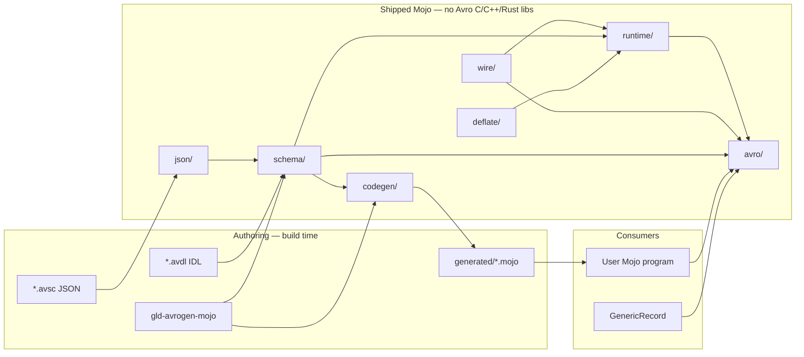

# Apache Avro for Mojo (`mojo-avro`)

| Field | Value |
| --- | --- |
| **Document title** | Apache Avro serializer for the Mojo programming language |
| **Author** | Leonid Ganeline |
| **Date** | 2026-09-06 |
| **Status** | Draft (rev 4) |
| **Target repo** | `/home/leo/PycharmProjects/GLD/gld-avro` (greenfield standalone library; empty directory as of 2026-09-06) |
| **License** | MIT, Copyright (c) 2026 Leonid Ganeline |
| **Recommended Mojo pin** | `mojo == 1.0.0` (stable, 2026-08-11) |
| **Spec target** | [Apache Avro 1.11.1 Specification](https://avro.apache.org/docs/1.11.1/specification/) (compatible with 1.12 encodings) |

---

## Overview

There is no production Apache Avro implementation for Modular Mojo as of 2026-09-06 (GitHub / Modular / modular-community search; this is a search result, not a hard negative proof). This document specifies a **standalone, from-scratch Mojo** Avro library for the empty `gld-avro` repository: independently buildable layers (wire, json, schema, deflate, codegen, runtime) plus an `avro` facade, a Mojo CLI that reads `.avsc` and `.avdl` in-process, generated structs with explicit encode/decode, and a dynamic `GenericRecord` path that applies official writer/reader schema resolution.

**Hard product constraint:** the shipped runtime and the codegen walker have **zero C, C++, or Rust Avro library dependencies**. They do not wrap, link, FFI, bind, or vendor libavro, avro-c, apache-avro-rs, or the JVM Avro SDK. Python `avro` and `fastavro` are a **test oracle** only. Apache `avro-tools` is optional for oracle checks and is not required to encode, decode, or run codegen once a schema file exists.

v1 ships the full encoding surface the user locked: binary datum, Object Container Files with codecs `null` and `deflate`, single-object encoding, and official Avro JSON encoding. Both codegen and `GenericRecord` ship in v1. Schema resolution ships in v1. Logical types stay underlying primitives.

The first test records (`Message`, `Document`, `Telemetry`, `Strings`, `Event`, `Batch_*`, `LongList`, mutual `A`/`B`) live under this repo’s `testdata/` as ordinary unit and interop test material. They are not the product schema and they are not a dependency on any other repository.

---

## Background & Motivation

### Why this change is needed

Mojo 1.0 shipped on 2026-08-11 with source stability, ownership, and C FFI. A Mojo program that speaks Avro today would have to wrap CPython `avro`/`fastavro` or link libavro. That measures someone else's runtime, fights Mojo ownership on every `String` / `List` crossing, and violates the no-Avro-native-library rule. This repo is a reusable Mojo codec and codegen tool.

The sibling library `gld-protobuf` proved the product shape: pixi + Mojo 1.0, four layers, generated structs, Python oracle goldens, MkDocs Pages, conda `mojoc` on prefix.dev. Avro is a different format. The wire is zigzag-varint without field tags, the schema is JSON (or IDL), and evolution is a first-class decode-time plan. The product packaging is the same.

### Current state of the repo

- `/home/leo/PycharmProjects/GLD/gld-avro` is an empty directory. It is not a git repository.
- `leo-gan/gld-avro` does not exist on GitHub yet.
- No Modular-Mojo Avro package was found in the 2026-09-06 search.

### Pain points this library must not inherit

- A stub that only knows the five v2 test records.
- Any linked C/C++/Rust Avro implementation.
- A reflection-only encoder: Mojo reflection sees Mojo fields, not Avro schema order or union branch indexes.
- Treating Avro JSON encoding as `json.dumps` of a dict.
- Skipping writer/reader resolution and still calling the result Avro.
- Coupling the library to `serializer-benchmark` or any other monorepo.

---

## Goals & Non-Goals

### Goals (v1 product)

1. **100% from-scratch Mojo** encode/decode of Avro binary, Avro JSON, OCF (`null` + `deflate`), and single-object encoding.
2. Independently buildable layers: `wire/`, `json/`, `schema/`, `deflate/`, `codegen/`, `runtime/`, plus `avro/` facade.
3. Parse `.avsc` JSON and Avro IDL (`.avdl`) in Mojo. No host Avro compiler is required to run codegen.
4. CLI `gld-avrogen-mojo` emits typed Mojo structs with explicit `encoded_len` / `encode_to` / `decode_from`.
5. Dynamic `GenericRecord` (and generic arrays, maps, unions, enums, fixed) using a parsed schema at runtime.
6. Official writer/reader schema resolution in v1: aliases, defaults, numeric promotions, string↔bytes, enum symbols, union resolution, field reordering.
7. Two-branch `["null", "T"]` and `["T", "null"]` map to `Optional[T]`. Other unions are tagged structs.
8. Interop on known data with official Python `avro` (and `fastavro` as a second oracle when useful).
9. Decoder walks a `Span[Byte]`. Encoder writes into a `List[Byte]` pre-sized from `encoded_len` when the size is known. Owned `String` / `List[Byte]` on decode.
10. Typed `DecodeError` with `kind: Int`, `offset: Int`, and `field: Int` (`0` means unknown).
11. Independently useful library. Not coupled to any other project.
12. Recursive named types in generated code: detect cycles on the named-type graph with strongly connected components. Emit heap `Box` for any field whose type (after unwrapping nullable / array / map) is in the current type’s SCC. Testdata includes `LongList` and mutual `A`/`B`. Non-optional recursive fields are a codegen error.

### Non-goals (v1)

- First-class logical-type codecs (decimal, uuid, date, time-millis/micros, timestamp-millis/micros, local-timestamp, duration). Store and round-trip the **underlying** primitive (`int` / `long` / `bytes` / `fixed` / `string`). Preserve `logicalType` plus leftover attributes (`precision`, `scale`, and any other unrecognized keys) on the schema model so a later PR can add codecs without a model change.
- Avro RPC, protocol message transport, handshake, or `mailbox`.
- IDL `protocol` RPC bodies as runnable stubs. IDL is parsed far enough to emit schemas for records, enums, fixed, errors-as-records, arrays, maps, unions, and imports (`import idl` → `.avdl`, `import schema` → `.avsc`, `import protocol` → JSON `.avpr`).
- Snappy, bzip2, xz, or zstandard OCF codecs.
- Confluent wire format (`0x00` + 4-byte schema id). Single-object encoding is the spec format (`C3 01` + CRC-64-AVRO).
- Schema Registry client.
- GPU encode/decode.
- Reflection-driven encode of arbitrary non-generated Mojo structs.
- C/C++/Rust Avro libraries, even as an optional path.

### Later (explicitly planned, not v1)

- Logical-type codecs.
- Additional OCF codecs.
- Optional Confluent framing helper that is clearly named and not the default.
- Zero-copy `StringSpan` views on decode.

---

## Proposed Design

### Product naming

| Surface | Name | Rationale |
| --- | --- | --- |
| Git repository | `gld-avro` | Already created as a directory; GitHub repo to create. |
| Public Mojo import | `avro` | What generated code and apps write (`from avro import …`). |
| Conda / pixi package | `mojo-avro` | Avoids colliding with conda-forge / PyPI `avro`. |
| Codegen CLI | `gld-avrogen-mojo` | Matches `gld-protoc-mojo`. |

### Packaging bootstrap (locked)

| Fact | Value |
| --- | --- |
| Initial `pixi.toml` version | `0.1.0`. Intermediate PRs do not bump it. One bump + prefix.dev publish after PRs 1–14 are on `main`. |
| Channels | `https://conda.modular.com/max` and `conda-forge`. |
| Platforms | `["linux-64"]`. |
| Mojo pin | `mojo == 1.0.0` in pixi; recipe build pin `mojo-compiler == 1.0.0`. |
| `from avro import …` | Development: `mojo -I src` (pixi `test` / `run-tests.sh` set this). Installed package: `$PREFIX/lib/mojo/avro.mojoc` plus the other published `.mojoc` files. Generated code imports only the `avro` facade. |
| Oracle extra | pixi feature `oracle` with `python` and `avro` (optional `fastavro`) for `scripts/gen_golden.py`. Not a runtime dependency. |
| Recipe about | homepage / repository `https://github.com/leo-gan/gld-avro`; license MIT; test via `conda.recipe/test_import.mojo`. |

**Precompile order** (`scripts/precompile.sh`), because later layers import earlier ones:

1. `wire.mojoc` (no in-repo deps)
2. `json.mojoc` (no in-repo deps)
3. `deflate.mojoc` (no in-repo deps)
4. `schema.mojoc` (needs `json`)
5. `runtime.mojoc` (needs `wire`, `json`, `schema`, `deflate`)
6. `avro.mojoc` (needs all of the above)
7. `gld-avrogen-mojo` binary (host tool; not a published `.mojoc`)

`scripts/ci-setup.sh` configures the Modular conda channel and documents that CI authenticates with a Modular token / `PREFIX_API_KEY`. Tokens are never committed. `scripts/check-generated.sh` regenerates `tests/generated/` and fails on git diff.

### Layer architecture

```text
gld-avro/
  src/wire/      # zigzag-varint, IEEE LE float/double, block counts
  src/json/      # in-tree JSON tokenizer + value tree
  src/schema/    # schema model, .avsc, .avdl, PCF, CRC-64-AVRO
  src/deflate/   # raw RFC 1951 inflate/deflate (Avro codec "deflate")
  src/codegen/   # gld-avrogen-mojo
  src/runtime/   # AvroDatum, GenericRecord, resolution, OCF, JSON, SOE
  src/avro/      # public facade
```



**Dependency rule:** generated code imports only `avro` (the facade). It never imports `schema` or `codegen`. `codegen` is a host tool. The published `.mojoc` set is `wire`, `json`, `schema`, `deflate`, `runtime`, `avro`.

### Repository layout

```text
gld-avro/
  pixi.toml
  pixi.lock
  LICENSE                          # MIT, (c) 2026 Leonid Ganeline
  README.md
  DESIGN.md
  .gitignore                       # includes temp/
  mkdocs.yml
  requirements-docs.txt
  conda.recipe/recipe.yaml
  src/
    wire/{__init__,varint,ieee,reader,writer,size}.mojo
    json/{__init__,token,value,parse,emit}.mojo
    schema/{__init__,model,parse_avsc,parse_avdl,parse_avpr,canonical,fingerprint,names}.mojo
    deflate/{__init__,inflate,deflate}.mojo
    codegen/{__init__,names,emit,cli}.mojo
    runtime/{__init__,error,datum,box,generic,resolve,ocf,json_codec,soe}.mojo
    avro/__init__.mojo
  testdata/
    avsc/                          # .avsc test schemas
    avdl/                          # .avdl test schemas
    avpr/                          # JSON protocol files for import protocol
    golden/                        # oracle bytes + .hex
  tests/
  tests_interop/
  docs/{index,why-avro,instructions,examples,test-data}.md
  scripts/{run-tests,gen_golden,generate,precompile,ci-setup,check-generated}.sh
  examples/encode_record.mojo
```

---

## Wire format (Layer `wire/`)

Avro binary encoding does not tag fields. The reader must know the schema. This is the opposite of protobuf.

### Primitive encodings

| Avro type | Bytes | Notes |
| --- | --- | --- |
| `null` | none | 0 bytes |
| `boolean` | 1 | `0x00` false, `0x01` true. Any other byte is `KIND_BAD_BOOL`. |
| `int` | zigzag varint | 32-bit range after un-ZigZag. Overflow is `KIND_RANGE`. |
| `long` | zigzag varint | 64-bit range. |
| `float` | 4 | IEEE-754 binary32 little-endian. `Float32(from_bits=…)`. |
| `double` | 8 | IEEE-754 binary64 little-endian. `Float64(from_bits=…)`. |
| `bytes` | long + data | length is a `long` (zigzag varint of the byte count). |
| `string` | long + UTF-8 | `String(from_utf8=)` remapped to `KIND_BAD_UTF8`. |
| `fixed` | N | raw N bytes, no length prefix. |
| `enum` | int | zero-based index into `symbols`. Out of range is `KIND_BAD_ENUM` unless resolution maps it. |
| `record` | concat | fields in **schema order**. |
| `array` | blocks | see below. |
| `map` | blocks | same as array of `(string, value)`. |
| `union` | long + value | branch index then the chosen type. |

### ZigZag and varint

Same algorithm as protobuf `sint64`, but Avro uses it for **all** `int` and `long` values, including lengths.

```
zigzag64(n) = (n << 1) ^ (n >> 63)   # arithmetic right shift
unzigzag64(u) = (u >> 1) ^ -(u & 1)
```

Varint is unsigned LEB128. Reject overlong encodings (more than 10 bytes, or a 10th byte that sets bits above the 64-bit remainder). This matches the official Java/Python readers in practice and is the only way to keep `offset` meaningful on corrupt input.

### Array and map blocks

An array is a sequence of blocks, then a zero count:

1. Read a `long` count.
2. If count is `0`, the array ends.
3. If count is negative, the block contains `-count` items and a following `long` is the block byte size (skip-size hint). The decoder may use the hint to bounds-check; it must still decode item-by-item.
4. If count is positive, decode that many items.
5. Repeat.

Maps use the same framing. Keys are Avro `string`.

### Reader / writer API

```mojo
struct WireReader[origin: ImmOrigin]:
    var buf: Span[Byte, origin]
    var pos: Int

    fn remaining(self) -> Int
    fn read_bool(mut self) raises DecodeError -> Bool
    fn read_int(mut self) raises DecodeError -> Int32
    fn read_long(mut self) raises DecodeError -> Int64
    fn read_float(mut self) raises DecodeError -> Float32
    fn read_double(mut self) raises DecodeError -> Float64
    fn read_bytes(mut self) raises DecodeError -> List[Byte]
    fn read_string(mut self) raises DecodeError -> String
    fn read_fixed(mut self, n: Int) raises DecodeError -> List[Byte]
    fn read_block_count(mut self) raises DecodeError -> Tuple[Int64, Int64]
    # (item_count, size_hint_or_neg1)

struct WireWriter:
    var buf: List[Byte]
    fn write_bool(mut self, v: Bool)
    fn write_int(mut self, v: Int32)
    fn write_long(mut self, v: Int64)
    fn write_float(mut self, v: Float32)
    fn write_double(mut self, v: Float64)
    fn write_bytes(mut self, v: Span[Byte])
    fn write_string(mut self, v: StringSlice)
    fn write_fixed(mut self, v: Span[Byte])
    fn write_block_start(mut self, count: Int64)
    fn write_block_end(mut self)
```

`write_block_end` writes the terminating block count: `write_long(0)`. It does not write a skip-size.

`encoded_len` helpers live in `wire/size.mojo`: `zigzag_varint_len`, `bytes_len`, `string_len`.

Encode to `List[Byte]` does **not** raise. Decode raises `DecodeError`.

---

## JSON value tree (Layer `json/`)

`.avsc` is JSON. Avro JSON encoding is JSON. The published package must parse and emit JSON without a C library and without EmberJson as a runtime dependency.

`src/json/` is a small in-tree tokenizer and value tree sufficient for:

- Avro schema documents (objects, arrays, strings, numbers, `true`/`false`/`null`).
- Avro JSON encoding (same plus arbitrary string content, including ISO-8859-1 bytes).

Numbers: keep the raw token text plus a parsed `Int64` when it fits, else `Float64`. Schema integers (`size`, enum we do not parse as numbers) are small. Emit a JSON number for every finite `int` / `long` / `float` / `double`. Reject `NaN` / `Infinity` on the JSON path (`KIND_BAD_JSON_NUMBER`), because standard JSON cannot represent them and official Avro JSON does not define a spelling.

`JsonValue` is an **arena of nodes** (integer child indexes). Mojo 1.0 cannot reliably form recursive `Optional[JsonValue]` / `List[JsonValue]` as a Deinitable tree. The arena avoids that.

```mojo
alias JSON_NULL = 0
alias JSON_BOOL = 1
alias JSON_INT = 2
alias JSON_FLOAT = 3
alias JSON_STRING = 4
alias JSON_ARRAY = 5
alias JSON_OBJECT = 6

struct JsonNode(Copyable, Movable):
    var kind: Int
    var b: Bool
    var i: Int64
    var f: Float64
    var s: String
    var first: Int          # first child index
    var count: Int          # child count (array) or pair count (object)
    # object keys are nodes first .. first+2*count-1 as [key, value, key, value, ...]

struct JsonError(Error):
    var message: String
    var offset: Int         # byte offset in the input; 0 if unknown
```

`parse_json(text: String) raises JsonError -> JsonDoc`. `emit_json(doc) -> String` with no extra whitespace. OCF `avro.schema` metadata uses `SchemaPool.original_json` (see Schema model). PCF has its own emitter.

---

## Schema model (Layer `schema/`)

### Types

Named types are stored once in a `SchemaPool` (arena). Every type reference is an `Int` id. This avoids recursive `List[Schema]` Deinitable failures (the gld-protobuf lesson).

```mojo
alias ST_NULL = 0
alias ST_BOOL = 1
alias ST_INT = 2
alias ST_LONG = 3
alias ST_FLOAT = 4
alias ST_DOUBLE = 5
alias ST_BYTES = 6
alias ST_STRING = 7
alias ST_RECORD = 8
alias ST_ENUM = 9
alias ST_ARRAY = 10
alias ST_MAP = 11
alias ST_UNION = 12
alias ST_FIXED = 13
alias ST_REF = 14          # named-type reference resolved to an id

struct FieldDesc(Copyable, Movable):
    var name: String
    var type_id: Int
    var has_default: Bool
    var default_json: String     # raw JSON text of the default, empty if none
    var aliases: List[String]
    var order: Int               # 0 ascending, 1 descending, 2 ignore
    var doc: String

struct SchemaNode(Copyable, Movable):
    var kind: Int
    var name: String             # fullname for named types
    var namespace: String
    var aliases: List[String]
    var doc: String
    var logical_type: String     # stored, not interpreted in v1
    var symbols: List[String]    # enum
    var enum_default: String     # empty if the enum has no default; else a symbol in `symbols`
    var fields: List[FieldDesc]  # record
    var item_id: Int             # array
    var value_id: Int            # map
    var branch_ids: List[Int]    # union
    var size: Int                # fixed
    var ref_id: Int              # ST_REF
    var leftover_attrs: Dict[String, String]
    # unrecognized object keys, values as raw JSON text.
    # decimal `precision` / `scale` land here so logical-type codecs
    # can be added later without a model change.

struct SchemaError(Error):
    var message: String
    var path: String        # JSON path or IDL location; empty if unknown

struct SchemaPool(Copyable, Movable):
    var nodes: List[SchemaNode]
    var by_name: Dict[String, Int]
    var root: Int
    var original_json: String
    # parse_avsc: the input .avsc text (trimmed).
    # parse_avdl: compact Avro schema JSON emitted from the model
    # (not PCF; keeps default, aliases, logicalType, leftover_attrs).
```

`SchemaPool` holds `List[SchemaNode]` and a `Dict[String, Int]` fullname index. The root schema is `root`. OCF metadata `avro.schema` is `pool.original_json`. `emit_schema_json(pool: SchemaPool, root: Int) -> String` rebuilds valid Avro schema JSON from the model (used by `parse_avdl` to fill `original_json`, and by tests).

### Name resolution

Follow the spec:

1. A name containing a dot is a fullname.
2. Otherwise, if the enclosing namespace is non-empty, fullname is `namespace + "." + name`.
3. Unnamed primitives never take a namespace.
4. After a named type is declared, later `"TypeName"` strings in that document resolve through the fullname table, then the enclosing namespace.

**Name grammar.** An unqualified name matches `[A-Za-z_][A-Za-z0-9_]*`. A namespace is empty or one or more unqualified names joined by `.`. Reject any name that does not match. Register a named type’s fullname **before** walking its fields/symbols so recursive references resolve. A string reference to an unknown name is `SchemaError` (primitives are the eight built-in names and never go through the table).

### `.avsc` parser

`parse_avsc(text: String) raises SchemaError -> SchemaPool`.

The parser is a recursive function:

```mojo
fn parse_schema(
    node: JsonNode,
    enclosing_ns: String,
    mut pool: SchemaPool,
) raises SchemaError -> Int
```

A schema production is a JSON **string**, **array**, or **object**. A field’s `type` is itself a schema.

| JSON shape | Meaning |
| --- | --- |
| string | Primitive (`null`, `boolean`, `int`, `long`, `float`, `double`, `bytes`, `string`) or a named-type reference. |
| array | Union. Each element is a schema. |
| object | Must have `"type"`. That `"type"` value is a schema: a string, an array, or a nested object. Remaining keys are attributes of this node (`name`, `namespace`, `fields`, `symbols`, `items`, `values`, `size`, `default`, `aliases`, `doc`, `logicalType`, `order`, plus leftovers). |

Examples the walker must accept:

- `{"name":"x","type":["null","string"],"default":null}` — field whose type is a union.
- `{"type":["null","int"],"default":null}` — union schema at field or root, `type` is an array.
- `{"type":"enum","name":"Color","symbols":["RED"]}` — inline named type.
- `{"type":{"type":"record","name":"Inner","fields":[...]}}` — `type` is a nested object.

**Unions.**

- Reject an empty union.
- Reject an immediately nested union (a union branch whose kind is `ST_UNION` after resolving `ST_REF`).
- Reject more than one branch of the same **non-named** kind: two `null`, two `boolean`, two `int`, two `long`, two `float`, two `double`, two `bytes`, two `string`, two arrays, two maps. Two records / enums / fixed with **different** fullnames are legal. Two named types with the same fullname are not.
- Duplicate check is by kind for primitives/arrays/maps, and by resolved fullname for named types.

**Union / field defaults.** Store defaults as raw JSON text on `FieldDesc.default_json`. Validate them during parse (PR 3 stores and checks shape; PR 7 decodes via `decode_default`). A default on a union field **must match the first branch** (Avro record-default rule):

- `["null","string"]` + `"default": null` — valid.
- `["string","null"]` + `"default": null` — `SchemaError` (`null` is not a `string`).
- `["string","null"]` + `"default": "hi"` — valid.

This is independent of the `Optional[T]` mapping, which still applies to both `["null","T"]` and `["T","null"]`.

PR 3 testdata includes: inline enum/record, `type` as array, `type` as nested object, nested-union reject, two-array reject, two differently named records accepted, illegal name, union default that does not match branch 0, recursive `LongList`.

### Avro IDL (`.avdl`) parser

```mojo
trait ImportResolver:
    fn resolve(
        self, kind: String, path: String, from_file: String
    ) raises SchemaError -> String
    # kind is "idl", "schema", or "protocol".
    # Returns file text. FileImportResolver reads path relative to from_file.
```

`parse_avdl(text: String, resolver: ImportResolver) raises SchemaError -> SchemaPool`.

v1 grammar subset:

- `protocol Name { ... }` (name is recorded; RPC is ignored).
- `record`, `error` (error is a record), `enum`, `fixed`.
- Fields: `type name [= default];`
- Types: primitives, `array<T>`, `map<T>`, `union { T, U }`, named references, nullable suffix `T?` which is `["null", T]`.
- `import idl "path";`, `import schema "path";`, and `import protocol "path";`.
- Annotations `@namespace("x")`, `@aliases([...])`, `@order("ignore")`, `@logicalType("timestamp-millis")` (stored only).

**Import kinds are different file formats.** `ImportResolver.resolve` returns file text; the caller chooses the parser from `kind`. Cycles (same resolved path already on the import stack) are `SchemaError`.

| Directive | File | Parser |
| --- | --- | --- |
| `import idl "path"` | `.avdl` | The IDL parser (`parse_avdl`). |
| `import schema "path"` | `.avsc` | `parse_avsc` / `parse_schema` on the JSON tree. |
| `import protocol "path"` | JSON `.avpr` | `parse_avpr`. **Not** the IDL parser. |

`parse_avpr(text: String, resolver: ImportResolver) raises SchemaError -> SchemaPool` walks Avro protocol JSON:

```json
{
  "protocol": "P",
  "namespace": "com.example",
  "types": [ { "type": "record", "name": "R", "fields": [] } ],
  "messages": { "send": { "request": [], "response": "null" } }
}
```

Required object keys: `protocol` (string), `types` (array of schema objects). `namespace` is optional and is the enclosing namespace for the `types` array. Each element of `types` is fed to `parse_schema`. **`messages` is ignored** (names, request, response, one-way, errors). A `.avpr` fed to `parse_avdl`, or a `.avdl` fed to `parse_avpr`, is `SchemaError`. Named types from the imported `types` array are merged into the caller’s pool.

Non-goals in the IDL parser: `message` / RPC bodies, `oneway`, `throws` as generated stubs. If a `message` appears in an `.avdl`, skip its body and continue so real-world `.avdl` files that mix data types and messages still yield the data types.

Imports read files relative to the including file.

#### IDL literals → Avro JSON

Field defaults in `.avdl` are IDL literals, not JSON. The parser converts each literal to Avro JSON text and stores that in `FieldDesc.default_json`. Validation then uses the same default decoder as `.avsc`.

| IDL literal | Stored `default_json` |
| --- | --- |
| `null` | `null` |
| `true` / `false` | `true` / `false` |
| integer literal | JSON number, no leading zeros except `0` |
| floating literal | JSON number |
| `"…"` string (IDL escapes decoded) | JSON string with JSON escapes |
| `[e1, e2, …]` | JSON array of converted elements |
| `{ k1: v1, k2: v2 }` (map) | JSON object |
| `{ field1 = v1, field2 = v2 }` (record) | JSON object `{"field1": …, "field2": …}` |
| enum symbol identifier | JSON string `"SYMBOL"` |
| bytes as a string literal | JSON string, ISO-8859-1 (same as Avro JSON `bytes`) |

An identifier that is not an enum symbol of the field type is `SchemaError`. Conversion happens at parse time; the rest of the stack only sees Avro JSON defaults.

### Parsing Canonical Form

Implement the spec transforms in order, then emit compact JSON:

1. **PRIMITIVES** — `"int"` not `{"type":"int"}`.
2. **FULLNAMES** — named types use fullname; drop `namespace`.
3. **STRIP** — keep only `type`, `name`, `fields`, `symbols`, `items`, `values`, `size`. Drop `doc`, `aliases`, `default`, `order`, `logicalType`.
4. **ORDER** — object keys in the order `name`, `type`, `fields`, `symbols`, `items`, `values`, `size`.
5. **STRINGS** — unescape to UTF-8.
6. **INTEGERS** — no quotes, no leading zeros.
7. **WHITESPACE** — none outside strings.

**Named-type emission from a `SchemaPool` graph.** Walk with a `seen` set of node ids:

- First visit of a named type (`record` / `enum` / `fixed`): emit the full object (after the seven transforms).
- Every later visit of that same id, including a recursive field such as `LongList.next`: emit only the fullname JSON string (`"ns.LongList"`), never the object again.

Without this rule the emitter either loops or disagrees with Python `avro.schema.Fingerprint`. PR 4 includes a recursive `LongList` PCF / CRC-64-AVRO golden against Python.

PCF is the input to fingerprints. Two schemas that differ only in `doc` or field defaults have the same PCF and the same CRC-64-AVRO.

### CRC-64-AVRO

Rabin fingerprint as specified in [Schema Fingerprints](https://avro.apache.org/docs/1.11.1/specification/#schema-fingerprints).

- Empty input fingerprints to `0xc15d213aa4d7a795`.
- Process each UTF-8 byte of the PCF string.
- Single-object encoding writes the 8-byte fingerprint **little-endian**.

Goldens: fingerprint of `"null"`, `"int"`, the v2 `Message` schema, and recursive `LongList`, compared to Python `avro.schema.Fingerprint` / `crc_64_avro`.

---

## Optional[T] and unions

A union of exactly two branches where one branch is `null` and the other is `T` (after resolving refs) is a **nullable**.

| Schema | Mojo field | Encode |
| --- | --- | --- |
| `["null", "string"]` | `Optional[String]` | `None` → long `0`. `Some(s)` → long `1` + string. |
| `["string", "null"]` | `Optional[String]` | `None` → long `1`. `Some(s)` → long `0` + string. |
| `["null", "int", "string"]` | tagged `union` struct | no `Optional` sugar. |
| `["int", "long"]` | tagged `union` struct | no `Optional` sugar. |
| `["null", "LongList"]` (recursive) | `Optional[Box[LongList]]` | same branch-index rule; `Box` is a heap pointer. |

The encoder always writes the **schema branch index**, not a made-up “null is always 0”.

Codegen names the tagged struct `RecordName_fieldName` or `NameUnion` if it is a top-level union schema. Each non-null branch is a static constructor.

### `Box[T]` (published heap indirection)

`Box` is not an inline wrapper and is not a stdlib type. An inline `struct Box[T]: var value: T` does not change layout and does not break Mojo 1.0 recursive Deinitable cycles. The published type lives in `src/runtime/box.mojo` and is re-exported from `avro` so generated code writes `from avro import Box`.

```mojo
struct Box[T: Copyable & Movable](Copyable, Movable):
    var _ptr: OwnedPointer[T]

    fn __init__(out self, var value: T):
        # Heap-allocate. T lives behind the pointer, not inline.
        self._ptr = OwnedPointer(value^)

    fn __copyinit__(out self, existing: Self):
        self._ptr = OwnedPointer(existing._ptr[])

    fn __moveinit__(out self, deinit existing: Self):
        self._ptr = existing._ptr^

    fn __getitem__(ref self) -> ref [self] T:
        return self._ptr[]
```

`Box` is **not** `Defaultable`. `Optional[Box[T]]` defaults to `None` and never constructs `T()`. Copy clones `T` onto a new heap cell. Move transfers the pointer.

If Mojo 1.0’s `OwnedPointer` name or constructor differs, the implementation uses the equivalent unique heap pointer; the public type name stays `Box` and the contract stays “heap cell, `__init__(var value: T)`, deref via `[]`”.

### Recursive generated records

Recursive named types are a **v1 goal**, not a non-goal. Mojo 1.0 cannot form `Optional[LongList]` / `List[LongList]` when `LongList` contains that field, and it cannot form `Optional[B]` on `A` when `B` has `Optional[A]`. Detection is **not** “self or enclosing.” Sibling top-level records that refer to each other are the same cycle.

**Named-type graph.** Nodes are named records in the `SchemaPool`. There is an edge `R → S` when named record `S` appears in a field type of `R` after walking arrays, maps, and every union branch (nullable or tagged). Enums and fixed are not nodes. Compute strongly connected components (Tarjan or Kosaraju). A named record is recursive when its SCC has a self-edge (`LongList → LongList`) or size greater than 1 (`A ↔ B`).

A field of current type `C` is a **recursive field** when the field type, after unwrapping a nullable union / array / map, is a named record in `C`’s SCC. Tagged-union branches are not unwrapped as a whole: each branch is classified on its own.

| Situation | Emitted field type |
| --- | --- |
| Nullable field whose unwrapped type is in `C`’s SCC | `Optional[Box[S]]`, zero-arg init `None` |
| Array of a type in `C`’s SCC | `List[Box[S]]`, zero-arg init empty |
| Map of a type in `C`’s SCC | `Dict[String, Box[S]]`, zero-arg init empty |
| Non-optional field whose type is in `C`’s SCC | **Codegen error.** Avro values of that shape are infinite; `C()` calling `Box(S())` does not terminate. |
| Tagged-union branch whose type is in `C`’s SCC | `Box[S]` on that branch payload. Zero-arg init selects the first branch (lowest index) whose type is **not** in `C`’s SCC. If every branch is in `C`’s SCC, **codegen error**. |
| Field whose type is not in `C`’s SCC | `Optional[T]` / `List[T]` / the named struct, with no `Box` |

Testdata `LongList` (`.avsc` and `.avdl`):

```json
{
  "type": "record",
  "name": "LongList",
  "fields": [
    {"name": "value", "type": "long"},
    {"name": "next", "type": ["null", "LongList"]}
  ]
}
```

Generated sketch:

```mojo
struct LongList(Copyable, Movable, Defaultable):
    var value: Int64
    var next: Optional[Box[LongList]]

    def __init__(out self):
        self.value = 0
        self.next = None

    def __init__(out self, value: Int64, next: Optional[Box[LongList]]):
        self.value = value
        self.next = next
```

Testdata mutual `A` / `B` (same `.avsc` document; also a matching `.avdl`):

```json
[
  {"type":"record","name":"A","fields":[{"name":"b","type":["null","B"]}]},
  {"type":"record","name":"B","fields":[{"name":"a","type":["null","A"]}]}
]
```

`A` and `B` share an SCC. Emitted fields are `Optional[Box[B]]` and `Optional[Box[A]]`, both zero-arg `None`. Emitting `Optional[B]` / `Optional[A]` is a codegen bug.

Testdata tagged union with recursive branch 0, on record `Node`:

```json
{
  "type": "record",
  "name": "Node",
  "fields": [
    {"name": "payload", "type": ["Node", "string"]}
  ]
}
```

`payload` is a tagged struct. The `Node` branch is `Box[Node]`. Zero-arg `Node()` selects the `string` branch (first non-recursive branch), not branch 0. A union whose every branch is in `Node`’s SCC (`["Node","A"]` when `A` is also in that SCC) is a codegen error.

---

## Runtime (Layer `runtime/`)

### `AvroDatum` trait

The trait is `AvroDatum`, not `Message`, so a generated record named `Message` keeps that name. It requires `Defaultable` so `decode` / `convert_to` can write `T()`.

```mojo
trait AvroDatum(Copyable, Movable, Defaultable):
    fn encoded_len(self) -> Int
    fn encode_to(self, mut enc: WireWriter)
    fn decode_from[origin: ImmOrigin](
        mut self, mut dec: WireReader[origin]
    ) raises DecodeError
    fn schema_json(self) -> String
```

`schema_json` returns the writer schema JSON string used for OCF, fingerprints, and as the reader schema for resolution. Generated implementations ignore `self` and return a constant. Callers that only have a type construct `T()` (legal because `Defaultable`) and read `T().schema_json()`.

`decode_from` is **same-schema only**: it walks this type’s field order. It is not the resolution path.

Free functions on the facade:

```mojo
fn encode[T: AvroDatum](value: T) -> List[Byte]

fn decode[T: AvroDatum, origin: ImmOrigin](
    buf: Span[Byte, origin]
) raises DecodeError -> T
# var value = T(); value.decode_from(WireReader(buf)); return value

fn decode_resolving[T: AvroDatum, origin: ImmOrigin](
    buf: Span[Byte, origin],
    writer_schema_json: String,
) raises DecodeError -> T
# parse writer_schema_json and T().schema_json();
# GenericDatum.decode_resolving(...);
# return convert_to[T](datum)

fn convert_to[T: AvroDatum](datum: GenericDatum) raises DecodeError -> T
```

**Resolution into generated types uses one path:** `GenericDatum.decode_resolving` then `convert_to[T]`. Codegen does **not** emit `resolve_from`. `convert_to` constructs `T()`, requires that `datum`’s reader-schema PCF equals `T().schema_json()` PCF (`KIND_RESOLVE` otherwise), and copies:

- primitives from `AvroNode` (`i` bits for float/double);
- record fields by reader name / index;
- arrays into `List`, maps into `Dict`;
- nullables into `Optional` (`AV_NULL` → `None`);
- recursive optional fields into `Optional[Box[T]]` (deref `Box` to copy `T`);
- enums by symbol;
- non-nullable unions into the generated tagged struct;
- `fixed` / `bytes` / `string` as owned values.

### `DecodeError`

```mojo
alias KIND_EOF = 1
alias KIND_BAD_VARINT = 2
alias KIND_RANGE = 3
alias KIND_BAD_BOOL = 4
alias KIND_BAD_UTF8 = 5
alias KIND_BAD_ENUM = 6
alias KIND_BAD_UNION = 7
alias KIND_BAD_BLOCK = 8
alias KIND_SCHEMA = 9
alias KIND_RESOLVE = 10
alias KIND_OCF = 11
alias KIND_DEFLATE = 12
alias KIND_JSON = 13
alias KIND_SOE = 14
alias KIND_BAD_JSON_NUMBER = 15

struct DecodeError(Error):
    var kind: Int
    var offset: Int
    var field: Int     # 0 if unknown; otherwise a small integer id
```

### Generic values

`AvroValue` is an arena node, same reason as JSON.

**Float / double storage:** bit-exact in `i`. `AV_FLOAT` stores the `Float32` IEEE bits in the low 32 bits of `i`. `AV_DOUBLE` stores the `Float64` IEEE bits as the full `Int64` of `i`. `f` is unused for those kinds. Accessors rebuild with `Float32(from_bits=…)` / `Float64(from_bits=…)`. This preserves NaN payloads on the binary path.

```mojo
alias AV_NULL = 0
alias AV_BOOL = 1
alias AV_INT = 2
alias AV_LONG = 3
alias AV_FLOAT = 4
alias AV_DOUBLE = 5
alias AV_BYTES = 6
alias AV_STRING = 7
alias AV_ENUM = 8
alias AV_FIXED = 9
alias AV_ARRAY = 10
alias AV_MAP = 11
alias AV_RECORD = 12
alias AV_UNION = 13

struct AvroNode(Copyable, Movable):
    var kind: Int
    var b: Bool
    var i: Int64              # int/long/enum index/union index;
                              # float/double IEEE bits (see above)
    var s: String
    var bytes: List[Byte]
    var first: Int
    var count: Int
    var schema_id: Int
```

`GenericRecord` / `GenericArray` / `GenericMap` / `GenericUnion` are write-through views over a node of the matching kind (layout below).

```mojo
struct GenericArena(Movable):
    var pool: SchemaPool
    var nodes: List[AvroNode]
    var schema_root: Int

# Small refcounted handle around GenericArena so get() can return
# a GenericDatum that shares pool and nodes without cloning the list.
# Increment on copy, decrement on deinit; free at zero.
struct SharedArena(Copyable, Movable):
    # implementation-defined refcount cell pointing at GenericArena

struct GenericDatum(Copyable, Movable):
    var arena: SharedArena
    var node_index: Int
    # pool / nodes / schema_root are arena[].*
    # node_index is this handle's node in arena[].nodes

    fn encode(self) -> List[Byte]
    fn encode_to(self, mut enc: WireWriter)
    fn encoded_len(self) -> Int

    @staticmethod
    fn decode[
        origin: ImmOrigin
    ](buf: Span[Byte, origin], schema: SchemaPool, root: Int) raises DecodeError -> GenericDatum

    @staticmethod
    fn decode_resolving[
        origin: ImmOrigin
    ](
        buf: Span[Byte, origin],
        writer: SchemaPool,
        writer_root: Int,
        reader: SchemaPool,
        reader_root: Int,
    ) raises DecodeError -> GenericDatum

    @staticmethod
    fn null(pool: SchemaPool, schema_id: Int) -> GenericDatum
    @staticmethod
    fn from_bool(pool: SchemaPool, schema_id: Int, v: Bool) -> GenericDatum
    @staticmethod
    fn from_int(pool: SchemaPool, schema_id: Int, v: Int32) -> GenericDatum
    @staticmethod
    fn from_long(pool: SchemaPool, schema_id: Int, v: Int64) -> GenericDatum
    @staticmethod
    fn from_float(pool: SchemaPool, schema_id: Int, v: Float32) -> GenericDatum
    @staticmethod
    fn from_double(pool: SchemaPool, schema_id: Int, v: Float64) -> GenericDatum
    @staticmethod
    fn from_bytes(pool: SchemaPool, schema_id: Int, v: List[Byte]) -> GenericDatum
    @staticmethod
    fn from_string(pool: SchemaPool, schema_id: Int, v: String) -> GenericDatum
    @staticmethod
    fn from_enum(pool: SchemaPool, schema_id: Int, symbol: String) raises DecodeError -> GenericDatum
    @staticmethod
    fn from_fixed(pool: SchemaPool, schema_id: Int, v: List[Byte]) raises DecodeError -> GenericDatum
    @staticmethod
    fn record(pool: SchemaPool, schema_id: Int) -> GenericDatum   # fields = defaults or null
    @staticmethod
    fn array(pool: SchemaPool, schema_id: Int) -> GenericDatum    # empty
    @staticmethod
    fn map(pool: SchemaPool, schema_id: Int) -> GenericDatum      # empty
    @staticmethod
    fn union(
        pool: SchemaPool, schema_id: Int, branch: Int, value: GenericDatum
    ) raises DecodeError -> GenericDatum

    fn is_null(self) -> Bool
    fn as_bool(self) raises DecodeError -> Bool
    fn as_int(self) raises DecodeError -> Int32
    fn as_long(self) raises DecodeError -> Int64
    fn as_float(self) raises DecodeError -> Float32
    fn as_double(self) raises DecodeError -> Float64
    fn as_bytes(self) raises DecodeError -> List[Byte]
    fn as_string(self) raises DecodeError -> String
    fn as_enum(self) raises DecodeError -> String
    fn as_fixed(self) raises DecodeError -> List[Byte]
    fn as_record(mut self) raises DecodeError -> GenericRecord
    fn as_array(mut self) raises DecodeError -> GenericArray
    fn as_map(mut self) raises DecodeError -> GenericMap
    fn as_union(mut self) raises DecodeError -> GenericUnion

struct GenericRecord[origin: MutableOrigin]:
    var parent: Pointer[GenericDatum, origin]
    var node_index: Int

    fn field_count(self) -> Int
    fn field_name(self, i: Int) raises DecodeError -> String
    fn has_field(self, name: String) -> Bool
    fn get(self, name: String) raises DecodeError -> GenericDatum
    fn get_at(self, i: Int) raises DecodeError -> GenericDatum
    fn set(mut self, name: String, value: GenericDatum) raises DecodeError
    fn set_at(mut self, i: Int, value: GenericDatum) raises DecodeError

struct GenericArray[origin: MutableOrigin]:
    var parent: Pointer[GenericDatum, origin]
    var node_index: Int

    fn __len__(self) -> Int
    fn get(self, i: Int) raises DecodeError -> GenericDatum
    fn set(mut self, i: Int, value: GenericDatum) raises DecodeError
    fn append(mut self, value: GenericDatum) raises DecodeError

struct GenericMap[origin: MutableOrigin]:
    var parent: Pointer[GenericDatum, origin]
    var node_index: Int

    fn __len__(self) -> Int
    fn has_key(self, key: String) -> Bool
    fn keys(self) -> List[String]
    fn get(self, key: String) raises DecodeError -> GenericDatum
    fn set(mut self, key: String, value: GenericDatum) raises DecodeError

struct GenericUnion[origin: MutableOrigin]:
    var parent: Pointer[GenericDatum, origin]
    var node_index: Int

    fn branch_index(self) -> Int
    fn branch_schema_id(self) -> Int
    fn value(self) -> GenericDatum
    fn set_branch(
        mut self, index: Int, value: GenericDatum
    ) raises DecodeError
```

**Write-through views.** Each view is `(Pointer[GenericDatum, MutableOrigin], node_index)` and must not outlive the parent `GenericDatum`. `as_record(mut self)` (and the other `as_*` views) bind `parent` to `self` and `node_index` to the record/array/map/union node.

`get` / `get_at` / `value` return a `GenericDatum` that **shares** the parent’s pool and nodes: the result copies the `SharedArena` handle (refcount +1) and sets `node_index` to the child. There is no subtree copy. The returned value is a handle into the same `List[AvroNode]`.

Mutation on a view (`set`, `set_at`, `append`, `set_branch`) writes `parent[].arena[].nodes`. After `set`, `parent.encode()` reflects the change. `set` of a child `GenericDatum` that already shares this arena updates the field’s child index only. `set` of a child from a different arena copies that child’s subtree into this arena, then stores the new index.

`SharedArena` is an internal type. Callers only see `GenericDatum` and the four view structs. If a later Mojo release makes `Pointer`+origin sufficient without a refcount, `get` may return an origin-bound handle instead; the user-visible contract stays “shares pool and nodes, writes through.”

Same-schema encode/decode is a single walk of the writer schema. Resolution is a compiled plan (next section).

---

## Schema resolution

Resolution is compiled once from `(writer_schema, reader_schema)` into a `ResolvePlan`: a tree of actions stored in an arena.

Actions:

| Writer | Reader | Action |
| --- | --- | --- |
| equal primitives | same | `Copy` |
| `int` | `long`/`float`/`double` | `Promote` |
| `long` | `float`/`double` | `Promote` |
| `float` | `double` | `Promote` |
| `string` | `bytes` | `Reinterpret` UTF-8 bytes |
| `bytes` | `string` | `Reinterpret` if valid UTF-8 else error |
| `null` / `boolean` | same | `Copy` |
| `fixed` | `fixed`, **unqualified name and size** match | `Copy` |
| record | record, names match (rule below) | per-field plan |
| enum | enum, names match (rule below) | symbol map; unknown writer symbol → reader `enum_default` if set, else error |
| writer field, no reader field | — | `SkipWriter` |
| reader field, no writer field | default required | `Default` |
| both have the field, possibly reordered | — | `FieldMap` (writer order decode, store by reader index) |
| array/map | array/map | plan on items/values |
| union | non-union | first compatible writer branch |
| non-union | union | first compatible reader branch |
| union | union | for each writer branch, first compatible reader branch |

**Named-type match (records, enums, fixed).** Avro 1.11.1 matches by **unqualified** name after applying **reader** aliases to the writer. Writer aliases are not a match key.

Algorithm:

1. Let `W` be the writer named type and `R` the reader named type.
2. Rewrite `W` using aliases from `R` only: if any of `R.aliases` equals `W.fullname`, `W`’s unqualified name, or `W.namespace + "." + W.name` (or the alias is a fullname that equals one of those), treat `W`’s name as `R`’s name.
3. After that rewrite, the types match when their **unqualified** names are equal. Different namespaces with the same short name match. For `fixed`, size must also be equal.
4. Writer-only aliases do not match. A writer `Foo` with alias `Bar` does not match a reader `Bar` that has no alias.

Required tests in PR 7:

- Writer `com.a.Foo` / reader `com.b.Foo` → match (same unqualified name).
- Reader `Bar` with alias `Foo`, writer `Foo` → match (reader alias rewrite).
- Writer `Foo` with alias `Bar`, reader `Bar` with no alias → no match.
- Fixed: same unqualified name, different size → no match.
- Fixed: same size, different unqualified name → no match.

A decoder that cannot apply a different reader schema is not the product default. `decode(buf)` on a generated type uses the generated schema as both writer and reader. `decode_resolving(buf, writer_schema_json)` builds a plan, decodes into `GenericDatum` under the reader schema, and `convert_to[T]`. `GenericDatum.decode_resolving` always goes through the plan; the same-schema plan is a trivial `Copy` tree.

Missing reader default is `KIND_RESOLVE` at compile-plan time, not at the first record.

### Default values

Defaults are Avro JSON. `default_json` is decoded with the **reader field type** using `decode_default` (the default-only Avro JSON subset, implemented in PR 7 in `src/runtime/json_codec.mojo`). Record defaults must include all fields that themselves lack defaults, recursively.

`decode_default(json_text: String, pool: SchemaPool, type_id: Int) raises DecodeError -> GenericDatum` accepts:

| Avro type | Accepted JSON |
| --- | --- |
| `null` | `null` |
| `boolean` | `true` / `false` |
| `int` / `long` | JSON number (integer in range) |
| `float` / `double` | JSON number |
| `string` | JSON string |
| `bytes` / `fixed` | JSON string, ISO-8859-1 |
| `enum` | JSON string (symbol) |
| `array` | JSON array |
| `map` | JSON object |
| `record` | JSON object; missing fields use their defaults |
| union | decoded as the **first branch type**, not as a union wrapper (record-default rule) |

PR 10 reuses `decode_default` for schema defaults and adds the full official JSON codec (union wrappers, document encode/decode) in the same file. PR 7 does **not** wait on PR 10.

---

## Object Container Files

File layout ([Object Container Files](https://avro.apache.org/docs/1.11.1/specification/#object-container-files)):

1. Magic `0x4F 0x62 0x6A 0x01` (`Obj1`).
2. Metadata map (`map<string, bytes>`):
   - `avro.schema` (required): UTF-8 schema JSON (not necessarily PCF). Written from `SchemaPool.original_json`.
   - `avro.codec` (optional): `null` or `deflate`. Missing codec means `null`.
3. 16-byte sync marker (random on write; must match every block).
4. Data blocks: `long` object count, `long` compressed-byte size, that many bytes, 16-byte sync.

```mojo
struct OcfWriter:
    fn __init__(out self, schema: SchemaPool, root: Int, codec: Int)  # 0 null, 1 deflate
    fn append[T: AvroDatum](mut self, value: T)
    fn append_generic(mut self, value: GenericDatum)
    fn finish(mut self) -> List[Byte]

struct OcfReader:
    var writer_schema: SchemaPool
    var codec: Int
    var sync: List[Byte]   # 16
    fn read_next_generic(
        mut self, reader_schema: SchemaPool
    ) raises DecodeError -> Optional[GenericDatum]

fn read_ocf[T: AvroDatum, origin: ImmOrigin](
    buf: Span[Byte, origin]
) raises DecodeError -> List[T]
```

`read_ocf[T]` opens the file, compiles a `ResolvePlan` from the file schema to `T().schema_json()`, decodes every datum as `GenericDatum` under the reader schema, `convert_to[T]` each one, and returns `List[T]`. Truncated file, bad magic, sync mismatch, or unknown codec is `KIND_OCF`. Generated types also expose `T.read_ocf(buf) -> List[T]` as a thin wrapper around the free function.

Block encode: serialize `count` objects into a raw buffer; if codec is `deflate`, compress that buffer with raw DEFLATE; write count, compressed size, bytes, sync. Count may be greater than 1. v1 writer may use count=1 per block; that is legal. A later PR can batch. The reader must accept any legal count.

Sync on write: 16 bytes from a counter + mix of schema fingerprint (deterministic tests pass a seed). Tests that compare whole files either use a fixed sync in the writer (test-only constructor) or compare decoded objects, not raw file bytes.

---

## Deflate (Layer `deflate/`)

Avro codec `deflate` is **raw DEFLATE** as in RFC 1951: no zlib header, no gzip header ([spec](https://avro.apache.org/docs/1.11.1/specification/#required-codecs)). Java `Deflater(nowrap=true)` / Python `zlib.compressobj(wbits=-15)`.

v1 implements inflate and deflate in Mojo in `src/deflate/`. This is not an Avro library. It is a compression algorithm required by a locked v1 codec.

Scope:

- Stored blocks, fixed Huffman blocks, and dynamic Huffman blocks on inflate (all three appear in real Avro files).
- Deflate writer may emit stored blocks and/or fixed Huffman. Dynamic Huffman on write is optional. Official readers accept any legal stream, so a correct stored+fixed writer still interops. Prefer a fixed-Huffman writer so files stay small enough for tests.

**Goldens are cross-inflate only.** Raw DEFLATE is not a stable byte string across compressors or levels. Do not compare `deflate_raw(data)` to CPython level-9 output.

| Direction | Oracle |
| --- | --- |
| Python → Mojo inflate | `zlib.compressobj(wbits=-15)` (works before Python 3.11; do not call `zlib.compress(data, 9, -15)`) |
| Mojo → Python inflate | `zlib.decompress(data, -15)` |
| Mojo → Mojo | round-trip |

If a later measurement shows a correctness hole, the fix is in `src/deflate/`, not a link to libavro. zlib FFI is forbidden by Key Decision 13.

---

## Single-object encoding

[Single object encoding](https://avro.apache.org/docs/1.11.1/specification/#single-object-encoding):

```
C3 01  |  fp64_le[8]  |  binary_datum
```

```mojo
fn encode_single_object[T: AvroDatum](value: T) -> List[Byte]
# fingerprint is CRC-64-AVRO of PCF(T().schema_json())

fn decode_single_object[T: AvroDatum, origin: ImmOrigin](
    buf: Span[Byte, origin]
) raises DecodeError -> T
# fingerprint must equal CRC-64-AVRO of T().schema_json();
# then same-schema decode[T]

fn decode_single_object[T: AvroDatum, origin: ImmOrigin](
    buf: Span[Byte, origin],
    writer_schema_json: String,
) raises DecodeError -> T
# fingerprint must equal CRC-64-AVRO of writer_schema_json;
# then decode_resolving[T](datum_bytes, writer_schema_json)

fn soe_fingerprint[origin: ImmOrigin](
    buf: Span[Byte, origin]
) raises DecodeError -> UInt64
```

Decode checks `C3 01`. The one-argument overload has no writer schema: a fingerprint mismatch is `KIND_SOE`. The two-argument overload is the resolution path; a fingerprint that does not match `writer_schema_json` is also `KIND_SOE`.

---

## Avro JSON encoding

This is the official Avro JSON encoding, not ProtoJSON and not a Python dict dump.

| Avro | JSON |
| --- | --- |
| `null` | `null` |
| `boolean` | `true` / `false` |
| `int` / `long` | JSON number |
| `float` / `double` | JSON number; reject NaN/Inf |
| `string` | JSON string |
| `bytes` | JSON string of ISO-8859-1 (code point = byte) |
| `fixed` | same as bytes, length must match |
| `enum` | JSON string of the symbol |
| `array` | JSON array |
| `map` | JSON object |
| `record` | JSON object, field names as keys |
| union, null branch | JSON `null` |
| union, non-null branch | `{"typeName": value}` |

**Union wrapper key for named types.** Encode uses the **user-specified (unqualified) name**, matching the spec example `{"Foo": {…}}` and official Java/Python readers. Decode accepts **either** the unqualified name **or** the fullname (`"Foo"` and `"com.example.Foo"`). Primitive branch keys stay `int`, `string`, and the other spec type names.

`["null","string"]` Some("a") encodes as `{"string":"a"}`. None encodes as `null`.

```mojo
fn encode_json[T: AvroDatum](value: T) raises DecodeError -> String
fn decode_json[T: AvroDatum](text: String) raises DecodeError -> T

fn encode_json_generic(value: GenericDatum) raises DecodeError -> String
fn decode_json_generic(
    text: String, schema: SchemaPool, root: Int
) raises DecodeError -> GenericDatum
```

`encode_json[T]` / `decode_json[T]` use `T().schema_json()`. JSON syntax errors from the tokenizer surface as `JsonError` remapped to `DecodeError` with `KIND_JSON` (offset preserved). Schema/value mismatches are `KIND_JSON` or `KIND_BAD_UNION`. **JSON encode raises** `DecodeError` with `KIND_BAD_JSON_NUMBER` on `NaN` / `Infinity`. That is a public `raises`, not a `debug_assert`. Binary `encode` / `encode_to` still do not raise.

---

## Codegen (`gld-avrogen-mojo`)

```text
gld-avrogen-mojo --schema testdata/avsc/benchmark_v2.avsc --out tests/generated
gld-avrogen-mojo --idl testdata/avdl/benchmark_v2.avdl --out tests/generated
```

`--schema` calls `parse_avsc`. `--idl` calls `parse_avdl` (wired in PR 11) then the same emitter. Output path: `out / fullname.split('.')[:-1] / Name.mojo`. `__init__.mojo` re-exports so `from benchmark.v2 import Message` works with `-I $out`.

Identifier mapping:

1. Avro field names stay as written if they are valid Mojo identifiers.
2. Mojo keywords (`struct`, `fn`, `var`, `raises`, `trait`, `from`, …): backtick-escape.
3. Runtime / stdlib clashes (`List`, `String`, `Optional`, `AvroDatum`, `DecodeError`, `Box`, …): append `_`.
4. Nested named types become module-level structs named `OuterInner`.

**Initialization.** Do **not** emit `@fieldwise_init`. That decorator plus a custom `__init__` is invalid in Mojo 1.0. Emit two explicit constructors and nothing else:

1. Zero-arg `def __init__(out self):` — each field set to the Avro type default (`0`, `False`, `""`, empty `List`/`Dict`, `None` for `Optional` including `Optional[Box[T]]`). Never construct `Box(T())` from the zero-arg init. This is what `Defaultable` / `T()` uses.
2. Fieldwise overload `def __init__(out self, field1: T1, field2: T2, …):` — assign each field from the argument.

Emitted methods: those two inits, `encoded_len`, `encode_to`, `decode_from`, `schema_json`, `encode` / `decode` wrappers, `read_ocf`, `write_to` for `Writable`, `Equatable`. No generated `resolve_from`. Generated code imports `Box` from `avro`.

v1 codegen emits every Avro type except that logical types are the underlying primitive. Maps become `Dict[String, V]`. Arrays become `List[T]`. Nullable unions become `Optional[T]` or `Optional[Box[T]]` when the unwrapped type is in the current type’s SCC. Other unions become a tagged struct; a recursive branch is `Box[S]`, and zero-arg init picks the first non-recursive branch (codegen error if none). A non-optional field whose type is in the current type’s SCC is a codegen error (infinite value).

---

## Test data

Copied **shapes**, not a dependency, from the v2 benchmark records. Each type is rewritten as `.avsc` (and a matching `.avdl`) under `testdata/`.

| Type | Why it exists |
| --- | --- |
| `Message` | scalars: bool, int, long, double, string, plus a second group of fields |
| `Document` | nested record, nullable nested record (`Optional`) |
| `Telemetry` | array of double |
| `Strings` | array of string |
| `Event` | enum plus a map |
| `Batch_*` | array of records |
| `LongList` | recursive record: `next: ["null", "LongList"]` → `Optional[Box[LongList]]`; also the PCF recursion golden |
| `A` / `B` | nullable mutual records (same SCC) → `Optional[Box[B]]` / `Optional[Box[A]]` |
| `Node` | tagged union `["Node","string"]`; `Box[Node]` on branch 0; zero-arg init uses the `string` branch |

Additional testdata (not benchmark shapes): unions with three branches, `fixed`, `bytes`, enum promotion, aliases, defaults, OCF files, SOE frames, Avro JSON documents, IDL imports, a JSON `.avpr` used by `import protocol`, union-default-must-match-branch-0, illegal nested unions, two-array unions, a non-optional recursive field that codegen must reject, a tagged union whose every branch is recursive (codegen reject).

These files are ordinary testdata, not a shared external suite.

Goldens are produced by `scripts/gen_golden.py` using Python `avro`. Each golden is a `.bin` plus a `.hex` sidecar.

---

## API / Interface Changes

This is a greenfield library. There is no previous public API.

Facade `src/avro/__init__.mojo` re-exports:

- `AvroDatum`, `encode`, `decode`, `decode_resolving`, `convert_to`
- `Box`
- `WireReader`, `WireWriter`
- `DecodeError` and `KIND_*`
- `JsonError`, `SchemaError`
- `ImportResolver`, `FileImportResolver`
- `SchemaPool`, `parse_avsc`, `parse_avdl`, `parse_avpr`, `canonical_form`, `crc64_avro`, `emit_schema_json`
- `GenericDatum`, `GenericRecord`, `GenericArray`, `GenericMap`, `GenericUnion`
- `OcfWriter`, `OcfReader`, `read_ocf`
- `encode_single_object`, `decode_single_object` (both overloads), `soe_fingerprint`
- `encode_json`, `decode_json`, `encode_json_generic`, `decode_json_generic`

---

## Data Model Changes

No persistent application database. On-disk artifacts:

- Generated Mojo under `tests/generated/` (checked in, like gld-protobuf).
- Descriptor-free: schemas are text. No binary `FileDescriptorSet` analog.
- OCF files and SOE frames in `testdata/golden/`.

---

## Alternatives Considered

| Alternative | Trade-off | Why not |
| --- | --- | --- |
| Wrap libavro / apache-avro-rs | Fast to a demo; measures C/Rust; ownership crossings | Forbidden by the product constraint. |
| Generic-only | Smaller codegen; slower; worse Mojo types | User locked both APIs. |
| Codegen-only | Faster; cannot decode a file whose schema arrived at runtime | OCF embeds a writer schema; GenericRecord is how you read it without a matching generated type. User locked both. |
| Skip OCF / JSON / SOE | Smaller v1 | User locked the full surface. |
| Skip resolution | Same-schema only | User locked resolution in v1. Without it, OCF written by an evolved writer cannot be read. |
| Host `avro-tools` instead of a Mojo schema parser | Avoids JSON/IDL work | User locked in-Mojo `.avsc` and `.avdl`. A host tool would also leak a Java runtime into codegen. |
| zlib C FFI for deflate | Less code, not an Avro library | Conflicts with the from-scratch Mojo rule we locked with the user (“1: all”). In-tree raw DEFLATE keeps the published runtime self-contained. |
| EmberJson as a runtime dep | Less JSON code | Extra package on the critical path; Avro JSON has bytes-as-ISO-8859-1 rules EmberJson will not know. In-tree JSON stays small and owned. |
| `@fieldwise_init` + custom zero-arg `__init__` | Less emitter code | Invalid in Mojo 1.0. Explicit zero-arg + fieldwise overload, no decorator. |
| Recursive generated structs as Generic-only | Avoids `Box` | User-facing codegen would reject `LongList`. Emit heap `Box` (`OwnedPointer`) instead. |
| Inline `struct Box[T]: var value: T` | No extra type in the runtime | Does not change layout; Mojo 1.0 recursive Deinitable still fails. |
| Parse `.avpr` with the IDL parser | One import walker | Spec `import protocol` loads JSON protocol files (`types` + `messages`). |
| Read-only generic views; mutation only on `GenericDatum` | Simpler ownership | Write-through views are specified: `(Pointer[GenericDatum], node_index)` plus `SharedArena` so `get` shares nodes. |
| Match named types by fullname / writer aliases | Closer to a misreading of the spec | 1.11.1 matches unqualified name after **reader** aliases; writer aliases are not a key. |
| JSON union key = fullname only | Unambiguous | Spec and Python/Java use the user-specified short name on encode. Decode accepts both. |
| PR 7 depends on PR 10 for defaults | One JSON decoder | Puts GenericRecord behind the full JSON codec. Extract `decode_default` in PR 7; PR 10 reuses it. |
| Byte-compare Mojo deflate to CPython level 9 | One golden file | Raw DEFLATE is not stable across compressors. Cross-inflate only. |

---

## Security & Privacy Considerations

- The decoder is a parser of untrusted bytes. Every length (`bytes`, `string`, array count, OCF block size) is bounds-checked against the remaining input before allocation. A `long` length that does not fit in `Int` or that exceeds remaining bytes is `KIND_RANGE` / `KIND_EOF`.
- OCF `avro.schema` metadata is JSON parsed with the same bounds. A multi-megabyte schema is accepted up to an explicit cap (`MAX_SCHEMA_BYTES = 4_194_304`). Above that: `KIND_SCHEMA`.
- Deflate inflate uses an output-size cap (`MAX_INFLATE = 64_194_304` per block) so a zip-bomb block cannot grow without bound.
- No TLS, auth, or secrets in this library. The prefix.dev publish workflow uses `PREFIX_API_KEY` in GitHub Actions, never in the library.
- Schema JSON may contain documentation strings; we do not log them at runtime.

---

## Observability

This is a library, not a service.

- `DecodeError.kind` / `offset` / `field` are the diagnostic surface.
- Codegen CLI writes human errors to stderr and exits non-zero. It does not emit partial files on error.
- No metrics API in v1.
- Tests print the failing golden name.

---

## Risks

| Risk | Impact | Mitigation |
| --- | --- | --- |
| In-tree RFC 1951 inflate, especially dynamic Huffman | OCF `deflate` files from Java/Python fail to read. Largest v1 delivery risk. | Goldens are cross-inflate with `zlib.compressobj(wbits=-15)` covering stored, fixed, and dynamic blocks. The writer emits stored+fixed only, so we never have to produce dynamic Huffman. A correctness hole is fixed in `src/deflate/`. zlib FFI and any Avro C/C++/Rust library remain forbidden (Key Decision 13). There is no compression fallback in v1. |

---

## Rollout Plan

1. Create the public GitHub repository `leo-gan/gld-avro` from the empty local directory (outside any PR; not a file change in PR 1).
2. Land the PR Plan below as incremental PRs on `main`. Do **not** bump the package version on those PRs.
3. **Publish is blocked** until PRs 1–14 (including PR 8b and PR 8c) are on `main` and CI is green. Then run the `bump-version` skill once. That creates the GitHub Release, which starts `publish.yml`. PR 14 is the conda recipe; it is not a license to publish an incomplete surface.
4. Rollback of a bad Release is “yank / skip-existing and ship the next tag”. The library has no feature flags.

---

## Open Questions

1. **If Modular ships `std.avro` later.** Keep this project’s import name `avro` and document the clash. Same posture as gld-protobuf vs a future `std.protobuf`.

All product forks (license, surface, API style, resolution, IDL, Optional[T], logical types, publish, init style, recursive `Box`, name match, JSON union keys, default-decode PR order, deflate test strategy) are Key Decisions, not open.

---

## Key Decisions

1. **100% from-scratch Mojo.** No C/C++/Rust Avro libraries. Python `avro`/`fastavro` are a test oracle only.
2. **Standalone library.** Not coupled to `serializer-benchmark`. v2 record shapes live in `testdata/` as ordinary test data.
3. **License MIT**, copyright (c) 2026 Leonid Ganeline.
4. **Import `avro`**, package `mojo-avro`, CLI `gld-avrogen-mojo`, repo `gld-avro`.
5. **Pin `mojo == 1.0.0`.** Initial package version `0.1.0`.
6. **v1 surface:** binary datum + OCF `null`/`deflate` + single-object encoding + official Avro JSON encoding.
7. **v1 APIs:** codegen and `GenericRecord`.
8. **Resolution in v1**, compiled to a `ResolvePlan`. Same-schema is a trivial plan.
9. **Parse `.avsc` and `.avdl` in Mojo.** No host Avro compiler for codegen.
10. **Nullable two-branch unions are `Optional[T]`.** Branch index follows the schema order.
11. **Logical types are stored and ignored as codecs in v1.** Underlying primitives round-trip. `leftover_attrs` holds `precision` / `scale` and other unrecognized keys.
12. **In-tree JSON arena** for schemas and Avro JSON encoding.
13. **In-tree raw DEFLATE** (RFC 1951, no zlib wrapper) for OCF codec `deflate`.
14. **Schema, JSON, and generic values are arenas of nodes** so Mojo 1.0 Deinitable recursion does not block the model.
15. **Trait name `AvroDatum`.** Generated `Message` keeps the name `Message`. The trait includes `schema_json()` and requires `Defaultable`.
16. **CRC-64-AVRO** of Parsing Canonical Form, little-endian in SOE. Empty fingerprint `0xc15d213aa4d7a795`.
17. **OCF writer may use one object per block.** Reader accepts any legal block.
18. **Binary encode does not raise.** Decode raises `DecodeError`. JSON encode (`encode_json` / `encode_json_generic`) raises `DecodeError` on `NaN` / `Infinity` (`KIND_BAD_JSON_NUMBER`).
19. **Version lives in `pixi.toml`.** Intermediate PRs do not bump it. One publish at the end, after PRs 1–14 are on `main`.
20. **`temp/` is gitignored.**
21. **Public GitHub `leo-gan/gld-avro`**, Pages, CI, conda recipe matching gld-protobuf packaging. Channels `conda.modular.com/max` + `conda-forge`; `platforms = ["linux-64"]`. `from avro import` via `-I src` or `$PREFIX/lib/mojo/avro.mojoc`.
22. **Codegen emits explicit zero-arg `__init__` plus a fieldwise overload. No `@fieldwise_init`.**
23. **Recursive generated records use heap `Box`** (`OwnedPointer[T]`, exported from `avro`). Recursion is the named-type SCC, not “self or enclosing.” Any field whose type (after unwrapping nullable / array / map) is in the current type’s SCC gets `Box`. Nullable recursive fields are `Optional[Box[T]]` defaulting to `None`. Non-optional recursive fields are a codegen error. Tagged-union zero-arg init uses the first non-recursive branch, or errors if every branch is recursive. Testdata includes `LongList`, mutual `A`/`B`, and `Node`. Not a non-goal.
24. **Resolution match** is unqualified name after applying **reader** aliases to the writer. Fixed also matches size. Writer-only aliases do not match.
25. **JSON union wrapper key:** encode the user-specified (unqualified) name; decode accepts short name and fullname.
26. **`decode_default` lives in PR 7.** PR 10 reuses it for the full JSON codec. PR 7 does not depend on PR 10.
27. **Resolution into generated types** is `GenericDatum.decode_resolving` + `convert_to[T]`. No generated `resolve_from`.
28. **Float/double bits in `AvroNode.i`.** Cross-inflate-only deflate goldens; `zlib.compressobj(wbits=-15)` in the oracle.
29. **PCF** emits the full named-type object on first visit and the fullname string on later visits (including recursion).
30. **`SchemaPool.original_json`** is the OCF `avro.schema` bytes. `write_block_end` is `write_long(0)`.
31. **`read_ocf[T] -> List[T]`.** `decode_single_object` has a writer-schema overload.
32. **`import protocol` loads JSON `.avpr`.** Take `types`, ignore `messages`. `import idl` uses the IDL parser. Do not parse `.avpr` as IDL.
33. **Generic views write through.** Each view is `(Pointer[GenericDatum, MutableOrigin], node_index)`. `get` returns a `GenericDatum` that shares pool and nodes via `SharedArena`.
34. **PR 12 depends on PR 13** and upgrades the docs skeleton. Two PRs do not own the same docs paths without that order.

---

## References

- [Apache Avro 1.11.1 Specification](https://avro.apache.org/docs/1.11.1/specification/) — encodings, OCF, resolution, PCF, fingerprints, logical types, JSON encoding, single-object encoding.
- [Avro IDL](https://avro.apache.org/docs/1.11.1/idl-language/) — `.avdl` grammar.
- [RFC 1951](https://www.rfc-editor.org/rfc/rfc1951) — DEFLATE.
- Sibling product shape: `/home/leo/PycharmProjects/GLD/gld-protobuf/DESIGN.md`.
- House style: `/home/leo/.grok/skills/improve-docs/references/STYLE.md`.
- Mojo 1.0: `ImmOrigin`, `from std.collections import List, Span, Dict, Optional`, `String(from_utf8=)`, `Process.run` / `ProcessStatus`.

---

## PR Plan

PRs land in `/home/leo/PycharmProjects/GLD/gld-avro`. Each is independently reviewable. Intermediate PRs do not bump the version. **Bump-version / prefix.dev publish is blocked until PRs 1–14 are on `main`.**

### PR 1 — Repo bootstrap

- **Title:** `chore: bootstrap pixi project and empty layers`
- **Files:** `pixi.toml`, `pixi.lock`, `LICENSE`, `README.md`, `DESIGN.md`, `.gitignore`, `src/{wire,json,schema,deflate,codegen,runtime,avro}/__init__.mojo`, `scripts/{ci-setup,run-tests,check-generated}.sh`
- **Depends on:** none
- **Changes:** Version `0.1.0`. Pin `mojo == 1.0.0`. Channels `https://conda.modular.com/max` and `conda-forge`. `platforms = ["linux-64"]`. MIT license. Commit this `DESIGN.md`. pixi task `test` runs `mojo -I src`. Feature `oracle` (`python`, `avro`) for later goldens. `scripts/ci-setup.sh` documents Modular channel auth and that `PREFIX_API_KEY` stays in CI secrets. `scripts/run-tests.sh` wraps the test task. `scripts/check-generated.sh` is a stub that becomes real in PR 6. Placeholder import test. Creating `leo-gan/gld-avro` on GitHub is a rollout step, not a file in this PR.

### PR 2 — Wire primitives + goldens

- **Title:** `feat(wire): zigzag varint, IEEE float/double, block counts`
- **Files:** `src/wire/*`, `src/runtime/error.mojo`, `tests/test_varint.mojo`, `tests/test_ieee.mojo`, `scripts/gen_golden.py`, `testdata/golden/`
- **Depends on:** PR 1
- **Changes:** int/long ZigZag varint; reject overlong; float/double LE; bytes/string/fixed; array block framing; `write_block_end` = `write_long(0)`. Goldens from Python `avro`.

### PR 3 — In-tree JSON + `.avsc` parser

- **Title:** `feat(schema): JSON arena and Avro schema parser`
- **Files:** `src/json/*`, `src/schema/{model,parse_avsc,names}.mojo`, `tests/test_json.mojo`, `tests/test_schema_avsc.mojo`, `testdata/avsc/`
- **Depends on:** PR 1
- **Changes:** `JsonError`. Recursive `parse_schema` accepting string / array / object, including `type` as a nested schema. Name grammar. Reject nested unions and illegal duplicate branch kinds. Validate union defaults against branch 0. `enum_default`, `leftover_attrs`, `SchemaPool.original_json`. Testdata: inline named types, `type` as array/object, `LongList`, illegal two-array union, union default mismatch.

### PR 4 — PCF + CRC-64-AVRO

- **Title:** `feat(schema): parsing canonical form and CRC-64-AVRO`
- **Files:** `src/schema/{canonical,fingerprint}.mojo`, `tests/test_canonical.mojo`, `tests/test_fingerprint.mojo`
- **Depends on:** PR 3
- **Changes:** Spec transforms. First visit of a named type emits the full object; later visits emit the fullname string only. Empty fingerprint `0xc15d213aa4d7a795`. Recursive `LongList` golden vs Python CRC-64-AVRO.

### PR 5 — `AvroDatum` + hand-written Message

- **Title:** `feat(runtime): AvroDatum and manual Message binary round-trip`
- **Files:** `src/runtime/{datum,box}.mojo`, `src/avro/__init__.mojo`, `tests/manual_types.mojo`, `tests/test_roundtrip_manual.mojo`, `tests/test_box.mojo`
- **Depends on:** PR 2
- **Changes:** Trait (`Defaultable` + `schema_json`) + encode/decode. `Box[T]` heap indirection (`OwnedPointer`, `__init__(var value: T)`, `[]` deref); export from `avro`. Human-written struct matching testdata `Message` with explicit zero-arg and fieldwise inits (no `@fieldwise_init`). Byte-compare to Python golden.

### PR 6 — Codegen for testdata records

- **Title:** `feat(codegen): gld-avrogen-mojo for benchmark.v2 records`
- **Files:** `src/codegen/*`, `scripts/generate.sh`, `scripts/check-generated.sh`, `testdata/avsc/benchmark_v2.avsc`, `testdata/avsc/longlist.avsc`, `testdata/avsc/mutual_ab.avsc`, `testdata/avsc/node_union.avsc`, `tests/generated/`, `tests/test_benchmark_v2.mojo`, `tests/test_codegen_names.mojo`, `tests/test_longlist.mojo`, `tests/test_mutual_ab.mojo`, `tests/test_node_union.mojo`
- **Depends on:** PR 3, PR 5
- **Changes:** Emit records, enums, arrays, maps, nullable `Optional[T]`, nested records. SCC recursion detection (not “self or enclosing”). `Optional[Box[T]]` for `LongList` and mutual `A`/`B` (zero-arg init `None`). Tagged union `Node.payload: ["Node","string"]` boxes branch 0 and zero-arg inits the `string` branch. Explicit inits only. `--schema` path. Reject non-optional recursive fields and tagged unions whose every branch is recursive. Reject unknown constructs loudly. `check-generated.sh` fails on drift.

### PR 7 — GenericRecord + resolution + default JSON

- **Title:** `feat(runtime): GenericDatum and writer/reader resolution`
- **Files:** `src/runtime/{generic,resolve,json_codec}.mojo`, `tests/test_generic.mojo`, `tests/test_resolve.mojo`, `tests/test_default_json.mojo`
- **Depends on:** PR 3, PR 5
- **Changes:** Full `GenericDatum` / `GenericRecord` / `GenericArray` / `GenericMap` / `GenericUnion` API. Views are `(Pointer[GenericDatum, MutableOrigin], node_index)` and write through. `get` returns a `GenericDatum` that shares pool and nodes via `SharedArena`. Float/double bits in `i`. ResolvePlan. Reader-alias name match; writer-only aliases do not match; fixed name+size. `decode_default` (default-only Avro JSON subset). Aliases, defaults, promotions, unions, enum `enum_default`, field reorder. `decode_resolving` + `convert_to[T]`. Does not depend on PR 10.

### PR 8 — Raw DEFLATE inflate

- **Title:** `feat(deflate): RFC 1951 inflate`
- **Files:** `src/deflate/{__init__,inflate}.mojo`, `tests/test_inflate.mojo`, `testdata/golden/deflate/`
- **Depends on:** PR 1
- **Changes:** Stored + fixed + dynamic Huffman inflate. Goldens: Python `zlib.compressobj(wbits=-15)` → Mojo inflate. Output cap `MAX_INFLATE`.

### PR 8b — Raw DEFLATE writer

- **Title:** `feat(deflate): RFC 1951 stored+fixed writer`
- **Files:** `src/deflate/deflate.mojo`, `tests/test_deflate.mojo`
- **Depends on:** PR 8
- **Changes:** Stored + fixed-Huffman writer. Goldens: Mojo compress → Python `zlib.decompress(..., -15)`; Mojo round-trip. No byte-compare against CPython compressor output.

### PR 8c — Object Container Files

- **Title:** `feat(ocf): object container files`
- **Files:** `src/runtime/ocf.mojo`, `tests/test_ocf.mojo`
- **Depends on:** PR 4, PR 7, PR 8b
- **Changes:** OCF magic, metadata from `SchemaPool.original_json`, sync, `null` and `deflate` codecs. `read_ocf[T] -> List[T]`. Reader applies resolution from the file schema via `GenericDatum` + `convert_to`.

### PR 9 — Single-object encoding

- **Title:** `feat(soe): C3 01 + CRC-64-AVRO single-object frames`
- **Files:** `src/runtime/soe.mojo`, `tests/test_soe.mojo`
- **Depends on:** PR 4, PR 5, PR 7
- **Changes:** Header write/read. One-arg `decode_single_object[T](buf)` (fingerprint must match `T`). Two-arg overload with `writer_schema_json` (resolution path).

### PR 10 — Avro JSON encoding

- **Title:** `feat(json-codec): official Avro JSON encode and decode`
- **Files:** `src/runtime/json_codec.mojo`, `tests/test_json_codec.mojo`
- **Depends on:** PR 3, PR 7
- **Changes:** Spec JSON encoding including union wrappers. Encode named-type keys as the user-specified short name; decode accepts short name and fullname. Reuse `decode_default`. `encode_json` / `decode_json` / `*_generic` signatures.

### PR 11 — Avro IDL parser

- **Title:** `feat(schema): Avro IDL parser`
- **Files:** `src/schema/{parse_avdl,parse_avpr}.mojo`, `src/codegen/cli.mojo`, `testdata/avdl/`, `testdata/avpr/`, `tests/test_idl.mojo`, `tests/test_avpr.mojo`
- **Depends on:** PR 3, PR 6
- **Changes:** records/enums/fixed/errors/imports/nullable `T?`. IDL-literal → Avro JSON conversion. `import idl` uses the IDL parser. `import schema` uses `parse_avsc`. `import protocol` uses `parse_avpr` on JSON `.avpr` (take `types`, ignore `messages`); do not run the IDL parser on `.avpr`. Wire `gld-avrogen-mojo --idl` through `parse_avdl` then the same emitter as `--schema`.

### PR 12 — Interop harness + full-surface docs

- **Title:** `test: Mojo ↔ official Python Avro interop`
- **Files:** `tests_interop/{encode_ref.py,decode_ref.py,ocf_ref.py,interop.sh}`, `docs/{instructions,examples}.md`
- **Depends on:** PR 6, PR 8c, PR 9, PR 10, PR 11, **PR 13**
- **Changes:** Pipe binary, JSON, OCF, SOE, IDL-generated types against Python `avro`. **Upgrade** the PR 13 skeleton `docs/instructions.md` and `docs/examples.md` to the full locked v1 surface. PR 13 lands first; this PR is the only later writer of those two paths.

### PR 13 — Docs skeleton, CI, Pages

- **Title:** `docs: skeleton, CI, and Pages`
- **Files:** `docs/*`, `mkdocs.yml`, `requirements-docs.txt`, `.github/workflows/{ci,pages}.yml`, `examples/encode_record.mojo`
- **Depends on:** PR 6
- **Changes:** Material theme matching gld-protobuf / anonymizer. Enable GitHub Pages (`build_type: workflow`). CI runs `scripts/ci-setup.sh`, `pixi run test`, and `mkdocs build --strict`. **Skeleton only:** index, Why Avro, Instructions outline, Examples placeholder, Test data. These pages must not claim GenericRecord, resolution, OCF, SOE, JSON, or IDL as shipped. PR 12 depends on this PR and upgrades Instructions/Examples.

### PR 14 — Conda recipe

- **Title:** `build: conda recipe and mojo precompile`
- **Files:** `conda.recipe/recipe.yaml`, `conda.recipe/test_import.mojo`, `scripts/precompile.sh`, `.github/workflows/publish.yml`
- **Depends on:** PR 11, PR 12, PR 13
- **Changes:** Precompile in order `wire` → `json` → `deflate` → `schema` → `runtime` → `avro`, then the `gld-avrogen-mojo` binary. Recipe pins `mojo-compiler == 1.0.0`. About URLs `https://github.com/leo-gan/gld-avro`. `test_import.mojo` does `from avro import …`. Publish workflow on GitHub Release. Do not bump the version in this PR.

Publish to prefix.dev happens after PR 14 via the `bump-version` skill, **once**, and **only** when PRs 1–14 are on `main`. The graph now makes GenericRecord, resolution, inflate, deflate, OCF, SOE, JSON, IDL, and interop ancestors of that publish.
